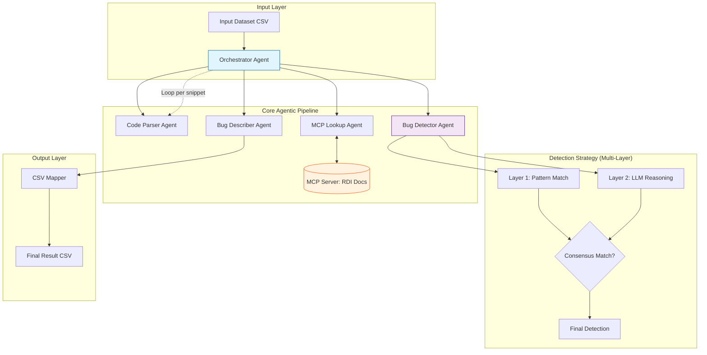

# 🔍 Agentic C++ Bug Detection System
> **An Intelligent multi-agent pipeline for automated bug identification and explanation in C++ code.**

[](https://www.python.org/downloads/)
[](https://opensource.org/licenses/MIT)
[](https://github.com/vasu-devs/A18-INFINION-)
[](https://modelcontextprotocol.io)

---

## 📖 Overview

The **Agentic C++ Bug Detection System** is a sophisticated automated code review tool designed for the **Infineon A18 Challenge**. It leverages a multi-agent orchestration architecture to identify, categorize, and explain bugs in C++ code snippets with high precision.

By combining documentation-aware pattern matching and advanced LLM reasoning, the system excels at detecting both common syntax errors and subtle logic flaws in specialized embedded C++ environments.

---

## 🏗️ Detailed Architecture

The system follows a modular, agentic flow where a central **Orchestrator** manages specialized agents. The core strength lies in its **Context-First** approach, where API documentation is retrieved and analyzed *before* the code is inspected.

### High-Level System Diagram



### ASCII Component Architecture

```text
+-----------------------------------------------------------------------+
|                         ORCHESTRATOR AGENT                            |
|  (Loop: Load CSV -> Dispatch Agents -> Consensus -> Export -> Cleanup)|
+--------+-----------------+-------------------+----------------+-------+
         |                 |                   |                |
         v                 v                   v                v
+----------------+ +----------------+ +----------------+ +----------------+
|  CODE PARSER   | |  MCP LOOKUP    | |  BUG DETECTOR  | | BUG DESCRIBER  |
| (Structure,    | | (RDI API Docs, | | (Pattern Match,| | (Human-Readable|
|  Identifiers)  | |  Pattern Search)| |  LLM Logic)    | |  Explanations) |
+----------------+ +-------+--------+ +----------------+ +----------------+
                           |
                           v
                  +------------------+
                  |  MCP SERVER      |
                  | (FastMCP + BGE)  |
                  +------------------+
```

---

## 🤖 Agent Workflows

Each agent in the pipeline has a specific, isolated responsibility. Click to expand and view the detailed internal logic for each agent.

<details>
<summary><b>1. Orchestrator Agent (The Brain)</b></summary>

The Orchestrator manages the lifecycle of the entire pipeline, ensuring per-snippet isolation and error handling.

**Workflow:**
1.  **Initialize**: Load configuration and initialize sub-agents.
2.  **Input Handling**: Read snippets from `Input.csv`.
3.  **MCP Lifecycle**: Start and connect to the local MCP server.
4.  **Looping**: For each code snippet:
    - Dispatch `CodeParserAgent`.
    - Retrieve documentation via `MCPLookupAgent`.
    - Run detection through `BugDetectorAgent`.
    - Generate summary via `BugDescriberAgent`.
5.  **Aggregation**: Collect all results (handling multi-bug scenarios).
6.  **Export**: Write structured results to `output.csv`.
</details>

<details>
<summary><b>2. Code Parser Agent (The Architect)</b></summary>

Converts raw C++ strings into a structured object for easier analysis by subsequent agents.

**Workflow:**
1.  **Classification**: Scans lines using regex to identify `Code`, `Comment`, `Preprocessor`, or `Blank`.
2.  **Numbering**: Generates a 1-indexed numbered string (e.g., `1: RDI_BEGIN();`) to prevent LLM hallucination of line numbers.
3.  **Identifier Extraction**: Pulls function names and API constants (e.g., `vForceRange`) to feed into the MCP lookup.
</details>

<details>
<summary><b>3. MCP Lookup Agent (The Librarian)</b></summary>

Acts as the bridge between the pipeline and the RDI API documentation using the Model Context Protocol.

**Workflow:**
1.  **Server Management**: Spawns the `mcp_server.py` process if not running.
2.  **Contextual Search**: Queries the server's `search_documents` tool using the snippet's context.
3.  **Identifier Search**: Performs targeted lookups for specific API calls found by the Parser.
4.  **Caching**: Stores retrieved documentation locally to avoid redundant vector searches.
</details>

<details>
<summary><b>4. Bug Detector Agent (The Inspector)</b></summary>

Uses a multi-layered approach to maximize precision while minimizing false positives.

**Workflow:**
1.  **Layer 1 (Pattern)**: Fuzzy-matches line content against "Bug Manual" patterns retrieved from MCP.
2.  **Layer 2 (LLM)**: Performs deep semantic analysis using a context-first prompt:
    - *Directive*: "Internalize API rules before reading code."
    - *Input*: MCP Manual + Context + Numbered Code.
3.  **Consensus**: Cross-references results. If multiple layers/models agree on a line, confidence is boosted.
4.  **Filtering**: Drops detections below the 70% confidence threshold.
</details>

<details>
<summary><b>5. Bug Describer Agent (The Teacher)</b></summary>

Transforms technical detection data into human-readable explanations that cite documentation.

**Workflow:**
1.  **Unified Context**: Consolidates all detected bugs for a single snippet.
2.  **Manual Mapping**: If a bug matched a known MCP pattern, it uses the official manual description.
3.  **LLM Narrative**: Generates a cohesive 1-paragraph explanation.
4.  **Constraint Enforcement**: Ensures every explanation starts with "Per the provided manual..." or "According to the documentation..." to satisfy rubric requirements.
</details>

---

## ✨ Key Features

- **🛡️ 2-Layer Detection Strategy**: Combines deterministic Pattern Matching with semantic LLM Reasoning.
- **🔌 MCP Integration**: Uses **Model Context Protocol** to dynamically query RDI API documentation, ensuring models have absolute precision.
- **🧠 Multi-Bug Support**: Identifies and reports multiple bugs in a single snippet, exported as comma-separated values.
- **📈 Professional CLI**: Richly formatted logging and summary reporting.
- **🧪 Multi-Provider**: Support for Gemini 2.0, DeepSeek V3, GPT-4o, and more.

---

## 🚀 Getting Started

### Prerequisites
- Python 3.10+
- API Keys for Gemini, OpenAI, or DeepSeek.

### Installation
1.  **Clone & Enter**:
    ```bash
    git clone https://github.com/vasu-devs/A18-INFINION-.git
    cd A18-INFINION-
    ```
2.  **Virtual Env**:
    ```bash
    python -m venv venv
    # Windows:
    venv\Scripts\activate
    # Linux/MacOS:
    source venv/bin/activate
    ```
3.  **Dependencies**:
    ```bash
    pip install -r requirements.txt
    ```
4.  **Config**: Create `.env` from `.env.example` with your keys.

### Usage
```bash
# Default run (uses Input.csv)
python main.py

# Custom IO and Model
python main.py --input my_dataset.csv --output results.csv --provider deepseek --model deepseek-chat
```

---

## 📂 Project Structure

```text
├── agents/             # Master-Slave Agent Architecture
│   ├── orchestrator.py # Agent 1: Flow Coordinator
│   ├── code_parser.py  # Agent 2: Structured Parsing
│   ├── mcp_lookup.py   # Agent 3: RDI Doc Retrieval
│   ├── bug_detector.py # Agent 4: Detection Logic
│   └── bug_describer.py# Agent 5: Explanation Generation
├── models/             # Pydantic Schemas for Data Integrity
├── utils/              # Client Wrappers & CSV IO
├── main.py             # CLI Entry Point
└── config.py           # Global Environment Settings
```

---

*Developed for the **Infineon A18 Recruitment Challenge**.*
