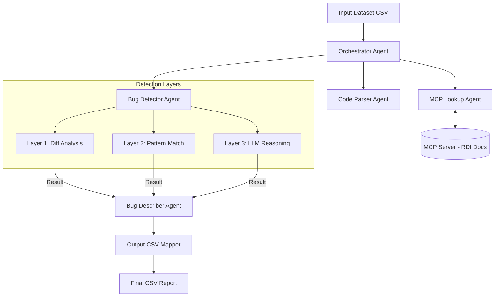

# 🔍 Agentic C++ Bug Detection System
> **An Intelligent multi-agent pipeline for automated bug identification and explanation in C++ code.**

[](https://www.python.org/downloads/)
[](https://opensource.org/licenses/MIT)
[](https://github.com/vasu-devs/A18-INFINION-)
[](https://modelcontextprotocol.io)

---

## 📖 Overview

The **Agentic C++ Bug Detection System** is a sophisticated automated code review tool designed for the **Infineon A18 Challenge**. It leverages a multi-agent orchestration architecture to identify, categorize, and explain bugs in C++ code snippets with high precision.

By combining traditional diff analysis, documentation-aware pattern matching, and advanced LLM reasoning, the system excels at detecting both common syntax errors and subtle logic flaws in specialized embedded C++ environments.

## ✨ Key Features

- **🤖 Multi-Agent Orchestration**: Integrated pipeline featuring specialized agents for parsing, documentation lookup, detection, and description.
- **🛡️ 3-Layer Detection Strategy**:
  - **Layer 1 (Diff)**: High-confidence detection using ground-truth comparisons (when available).
  - **Layer 2 (Pattern)**: Intelligent matching against a dynamic "Bug Manual" via MCP.
  - **Layer 3 (LLM)**: Deep semantic analysis using state-of-the-art models (Gemini 2.0, DeepSeek V3, GPT-4o).
- **🔌 MCP Integration**: Uses the **Model Context Protocol** to dynamically query RDI API documentation and bug patterns, ensuring the models have the most relevant technical context.
- **🧠 Multi-Bug Support**: Capable of identifying and reporting multiple bugs within a single code snippet, exported as structured comma-separated data.
- **📈 Comprehensive Logging**: Rich, formatted console output and persistent CSV reporting for easy result auditing.

## 🏗️ System Architecture



## 🚀 Getting Started

### Prerequisites

- Python 3.10 or higher
- API Keys for your preferred LLM provider (Gemini, OpenAI, or DeepSeek)

### Installation

1. **Clone the repository**:
   ```bash
   git clone https://github.com/vasu-devs/A18-INFINION-.git
   cd A18-INFINION-
   ```

2. **Set up virtual environment**:
   ```bash
   python -m venv venv
   source venv/bin/activate  # On Windows: venv\Scripts\activate
   ```

3. **Install dependencies**:
   ```bash
   pip install -r requirements.txt
   ```

4. **Configure Environment Variables**:
   Create a `.env` file in the root directory (or copy from `.env.example`):
   ```ini
   LLM_PROVIDER=gemini
   GEMINI_API_KEY=your_key_here
   LOG_LEVEL=INFO
   ```

### Usage

Run the pipeline using the default input:
```bash
python main.py
```

Specify custom input/output and model:
```bash
python main.py --input test_data.csv --output results.csv --provider deepseek --model deepseek-chat
```

**CLI Arguments**:
- `--input`, `-i`: Path to the input CSV dataset.
- `--output`, `-o`: Destination path for the result CSV.
- `--provider`, `-p`: Override the LLM provider (openai, gemini, deepseek, groq).
- `--test-mode`, `-t`: Simulates a blind test set by ignoring correct code columns.

## 📂 Project Structure

```text
├── agents/             # Core specialized agents
│   ├── bug_detector.py # Multi-layered detection logic
│   ├── mcp_lookup.py   # Connection to MCP server
│   └── orchestrator.py # Flow coordinator
├── models/             # Pydantic schemas for data integrity
├── utils/              # Client wrappers and diff utilities
├── main.py             # CLI entry point
├── config.py           # Global configuration management
└── input_dataset.csv   # Sample dataset for analysis
```

## 🤝 Contribution

Contributions are welcome! Whether it's adding new detection patterns, improving agentic prompts, or enhancing the MCP integration.

1. Fork the Project
2. Create your Feature Branch (`git checkout -b feature/AmazingFeature`)
3. Commit your Changes (`git commit -m 'Add some AmazingFeature'`)
4. Push to the Branch (`git push origin feature/AmazingFeature`)
5. Open a Pull Request

---

*Developed as part of the **Infineon A18 Recruitment Challenge**.*
